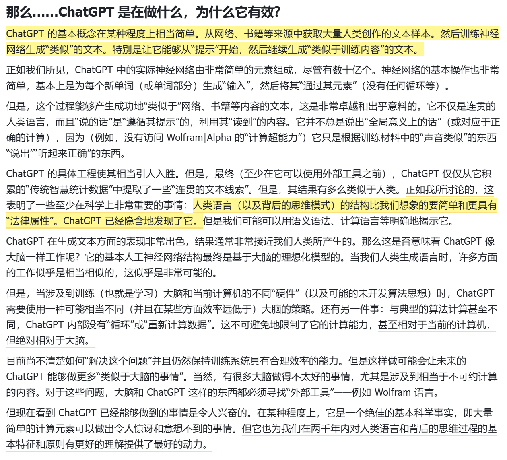

# ChatGPT是在做什么，为什么它有效?

ChatGPT是以"词"为单位进行文本生成的

首先要解释的是，ChatGPT始终基本上是在尝试生成"文本的合理延续"，这个延续是基于已有的文本，其中"合理"的意思是"在查看了数十亿个网页等人类编写的文本之后，我们可能会期望某个人会写下这样的内容。

因此，我们假设已有文本为"人工智能最专长的一点是...，然后想象一下扫描数十亿个人类编写的文本(例如网络内容和数字化书籍)，找到所有这些文本的实例，看看下一个单词出现的频率是多少。ChatGPT实际上做了一些类似的事情，但(如我将解释的那样)它不是直接查看文字，而是寻找在某种意义上"匹配"内容。无论如何，最终它生成了一个排名，列出可能跟随文本的单词和它们的"概率"。

每一步，ChatGPT都会生成一个带有概率的单词列表。但是，它应该选择哪一个单词添加到正在写的文章(或其他内容)中呢?人们可能认为应该选择"排名最高"的单词(即被分配了最高"概率"的单词)。但是在这里，一些巫术开始悄悄渗入进来。因为由于某种原因(也许有一天我们会科学地理解它)，如果我们总是选择排名最高的单词，我们通常会得到一篇非常"平淡"的文章，似乎从来没有"展现出任何创造力"(甚至有时完全重复)。但是如果有时(随机地)选择排名较低的单词，我们就能得到一篇"更有趣"的文章。

这里有随机性意味着，如果我们多次使用相同的提示，我们可能每次都会得到不同的文章。并且，符合巫术思想的是[注:就像炼丹一样，莫名其妙的配方产生了特别好的效果]，有一个特定的所谓"温度"参数，它控制了较低排名的单词会被使用的频率。对于文章生成，我们发现"温度"为0.8效果最好。(值得强调的是，这里没有使用任何"理论"，而只是基于实践的发现。例如，这里的"温度"的概念，对应于统计物理学中熟悉的指数分布上的温度，但至少就我们所知，这两个温度没有"物理"上的联系。)

那么这些概率从何而来呢?

在网络爬行中可能有数干亿个单词;在已数字化的书籍中可能有另外数百亿个单词。但是，对于40,000个常用单词，即使是可能的二元组也已经有16亿个，三元组的数量是60万亿。因此，我们无法从已有的文本中估计所有这些可能性的概率。而当我们到达20个单词的"文章片段"时，可能性的数量比宇宙中的粒子数量还要大，因此从某种意义上说，它们永远都无法全部写下来。

那么我们该怎么办?大的想法是制作一个模型，让我们估计序列应该出现的概率，即使我们在查看的文本语料库中从未明确看到这些序列。而ChatGPT的核心正是一个被称为"大型语言模型"(LLM)的模型，，它的设计使得它在估计这类概率方面做得很好。

神经网络，本质就是数以亿计个参数，神经网络越好，参数越多。

